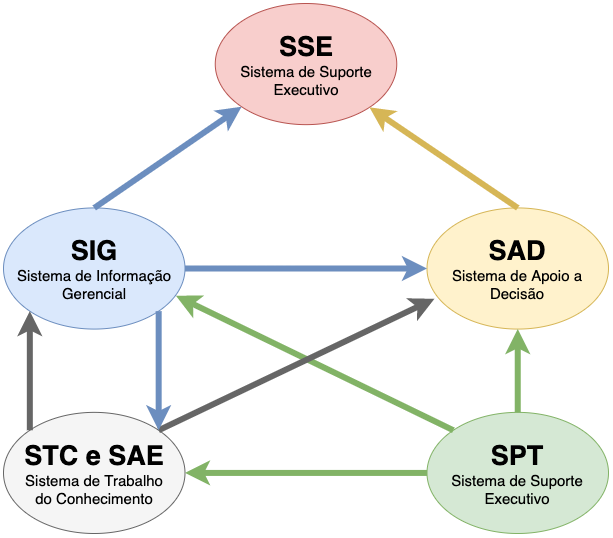
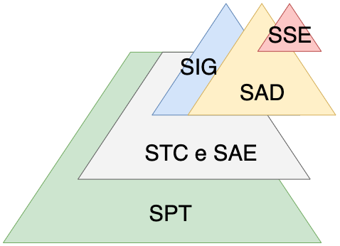
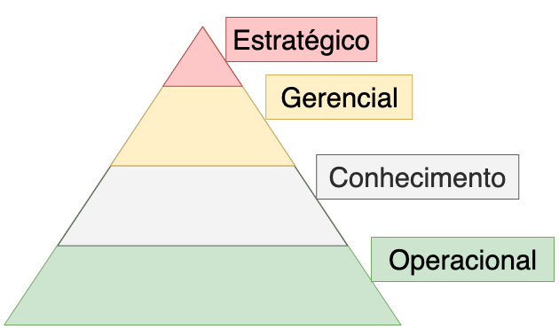

# Sistemas de Informação

## Integrantes

- Anderson Gama
- Artur Reis
- Gabriel Oliveira Silva
- João Vitor
- Tiago Brandão
- Vitor Oliveira Silva

## Parte 1

- [Introdução](#Introdução)
- [SPT's](#SPT's)
- [STC's](#STC's)
- [SAE's](#SAE's)
- [SIG's](#SIG's)
- [SAD's](#SAD's)
- [SSE's](#SSE's)

### Introdução

[Início](#Parte-1)

### SPT's

- O que são?
- Nível de atuação hierárquico
- Caracteristicas
- Entradas
- Saídas

[Início](#Parte-1)

### STC's

- O que são?
- Nível de atuação hierárquico
- Caracteristicas
- Entradas
- Saídas

[Início](#Parte-1)

### SAE's

- O que são?
- Nível de atuação hierárquico
- Caracteristicas
- Entradas
- Saídas

[Início](#Parte-1)

### SIG's

- O que são?
- Nível de atuação hierárquico
- Caracteristicas
- Entradas
- Saídas

[Início](#Parte-1)

### SAD's

- O que são?
- Nível de atuação hierárquico
- Caracteristicas
- Entradas
- Saídas

[Início](#Parte-1)

### SSE's

- O que são?
- Nível de atuação hierárquico
- Caracteristicas
- Entradas
- Saídas

[Início](#Parte-1)
