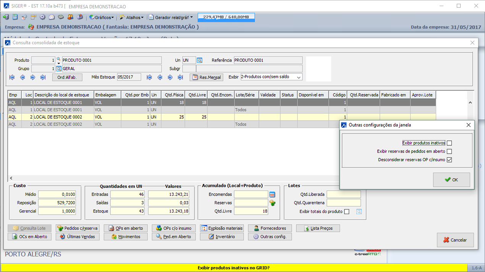
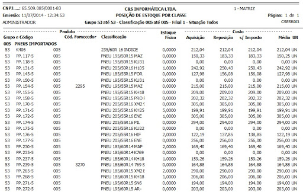
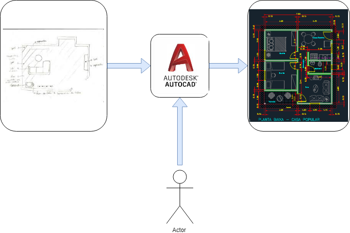
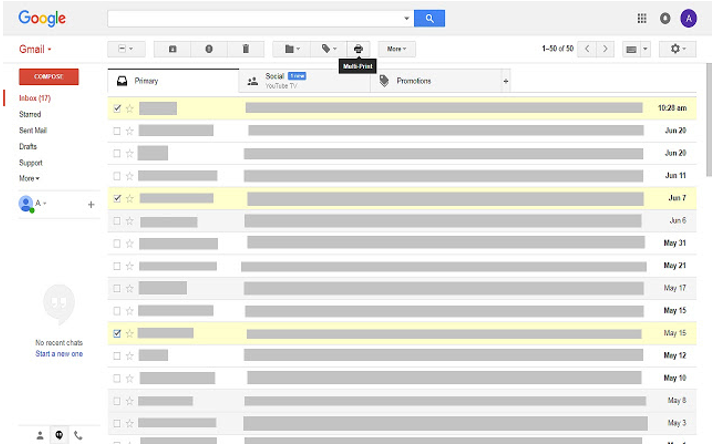
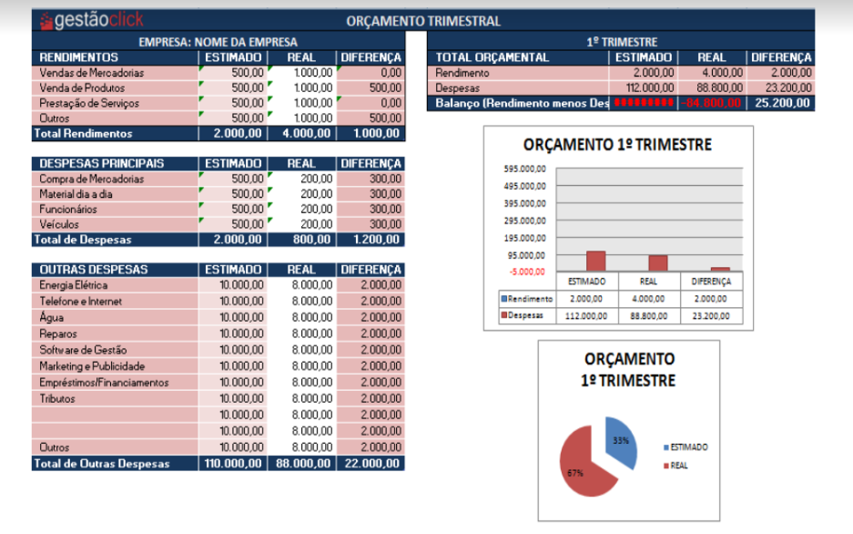
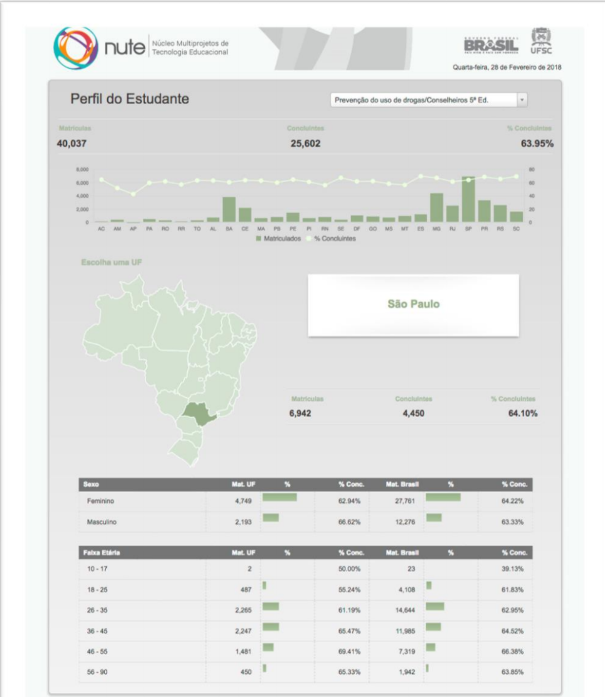
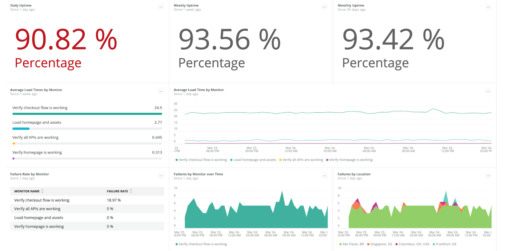
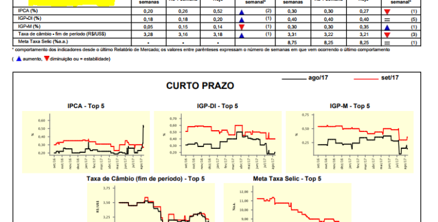

# Sistemas de Informação

## Integrantes

- Anderson Gama
- Artur Reis
- Gabriel Oliveira Silva
- João Vitor
- Tiago Brandão
- Vitor Oliveira Silva

## Parte 1

- [Introdução](#Introdução)
- [SPT's](#SPT's)
- [STC's](#STC's)
- [SAE's](#SAE's)
- [SIG's](#SIG's)
- [SAD's](#SAD's)
- [SSE's](#SSE's)

### Introdução

> Sistemas de Informação é a expressão utilizada para descrever um Sistema seja ele automatizado (que pode ser denominado como Sistema Informacional Computadorizado), seja manual, que abrange pessoas, máquinas e/ou métodos organizados para coletar, armazenar,processar, transmitir e disseminar dados que representam informação para o usuário e/ou cliente.

Fonte: https://pt.wikipedia.org/wiki/Sistema_de_informa%C3%A7%C3%A3o

Diz-se de sistemas de informação o agrupamento de técnicas e tecnologias empregadas para um dado fim, sempre com o objetivo de agregar/beneficiar dados, para obter algum tipo de informação. A valiosidade ou valor da informação é definida pelo valor agregado que esta traz ao usuário/cliente do sistema.

Se tratando do ambiente coorporativo sistemas desempenham papéis diferentes nos níveis hierárquicos e organizacionais da empresa, e muitas vezes são combinados para gerar fluxos de trabalho independentes e resilientes.

Por isso estes sistemas são classificados de acordo com o nível organizacional em que operam ou oferecem suporte. Estes podem operar em nível operacional, conhecimento, tático e estratégico.
 Sendo que suas saídas/entradas podem ser compartilhadas entre os outros sistemas de outros níveis organizacionais.

São os sistemas de informação: 
- <b>Sistema de processamento de transações</b> (nível operacional - monitoram, coletam, persistem e processam dados gerados em todas as transações da empresa), 
- <b>Sistema de Trabalho do conhecimento</b> (nível operacional/conhecimento - consultam, cruzam dados, geram novas informações a partir dos dados transacionais),
- <b>Sistema de Informação Gerencial</b> (nível tático/gerencial - produzem relatórios com base nas transações, e informações geradas para dar suporte para gerentes intermediários),
- <b>Sistema de Apoio a Decisão</b> (nível tático/gerencial - coletam informação e as cruzam em modelos de dados, para resolver problemas e fazer predições).
- <b>Sistema de Suporte Executivo</b> (nível estratégico - cruza as informações processadas na organização com dados externos de concorrentes, mercado, clientes e etc... ).

Os sistemas tendem a se comunicar com a camada imediatamente superior, sempre no sentido em que suas saídas alimentam o próximo nível da pirâmide organizacional, mesmo não sendo uma regra muito clara, uma vez que estes podem fornecer informações a outros níveis como mostrado na figura abaixo:

> Observe que sistemas transacionais contem grande volume de dados, e suas saídas são utilizadas por diversos níveis. Na ilustração cada tipo de sistema consome informação do sistema que sobrepõe.

[Início](#Parte-1)

### SPT's

- O que são?
   > - Sistemas de processamento de transação são sistemas responsáveis por persistir os dados significantes a todas as operações realizadas durante o processo produtivo. Representam as unidades transacionais, onde um conjunto de registros representam uma determinada informação.
   Ex.: Uma nova compra gera um conjunto de registros pertinentes a ela, onde estes identificam, compra, produto, movimentação de estoque e etc...

- Nível de atuação hierárquico
    > - Operacional
- Caracteristicas
    > - Normalmente usados em escala macro, mas que por sua vez buscam o maior nível de detalhe o possível. Os registros são compostos por detalhes que descrevem as entidades presentes no sistema e seus relacionamentos, essa caracteristica faz com que sejam normalmente implementados utilizando bancos de dados relacionais e modelagem de classes/entidades, os dados persistidos são fieis ao molde das classes e tendem a apresentar problemas quanto à persistencias das informações a longo prazo, devido à mudanças nos escopos durante a utilização do software. São responsáveis pelo maior volume de escrita e leitura, onde geram estresse no sistema. A concorrência também é um problema grande em sistemas de processamento de transações uma vez que podem escrever ao mesmo tempo em um mesmo registro. São responsáveis pela evolução dos sistemas de bancos de dados uma vez que forçam a melhoria continua da tecnologia para agregar o máximo de dados o possível.
- Entradas
> - As entradas deste sistema são exatamente as transações que a organização realiza, limitadas ao nicho do software. Softwares de gestão financeira gravaram dados pertinentes a informação financeira e assim por diante. As entradas são definidas pela abordagem e propósito do software, mas representam sempre uma operação utilizando o conjunto das menores unidades.
- Saídas
> - Relatórios transacionais são em grande parte, dados tabulados, advindos de relacionamentos entre os dados gravados na base de dados, são caracterizados pelo estilo tabulado e em sua grande maioria com agregadores de informação para exibir totais e detalhes, como tempo de operação data de criação,usuário criador. e etc.

[Início](#Parte-1)

### STC's

- O que são?

> Sistemas de trabalho do conhecimento são sistemas onde os dados transacionais são operados/analisados pelo trabalhador e estes viram informação que tem valor dentro da empresa, ou sendo o próprio produto. Estes sistemas oferecem ferramentas para aplicação do conhecimento do trabalhador de forma direcionada para desenvolver idéias/produtos e informações. Necessitam de interação ativa com o usuário.

> Exemplo: Autocad. Através de uma especificação técnica o profissional utilizando dos seus conhecimentos desenvolve no Autocad o desenho correspondente, desta forma seu conhecimento foi transformado em produto.
- Nível de atuação hierárquico

Nível operacional

- Caracteristicas
  - Linguagem técnica.
  - Oferencem muitas ferramentas.
  - Softwares de nichos.
  - Necessitam de operadores.

- Entradas
  - Especificações técnicas.
  - Ordens de serviço.
  - Dados transacionais.

- Saídas
  - Desenhos.
  - Relatórios.
  - Plantas.
  - Projetos.
  - Softwares.

[Início](#Parte-1)

### SAE's

- O que são?

>Sistemas de automação de escritório visam, modernizar e automatizar o fluxo de trabalho em organizações, reduzindo documentos físicos, disponibilizando artefatos digitais e provendo ferramentas de gerenciamento e acompanhamento de uma forma simples, utilizando interfaces fluidas.
- Nível de atuação hierárquico

>Conhecimento

- Caracteristicas
 >  - Redução de papeis.
 >  - Melhoria no atendimento.
 > - Minimização dos erros.
 > - Racionalização de processos.
 > - Troca e aproveitamento das informações.
 >  - Obtenção de informações confiáveis e atualizadas constantemente.

- Entradas
> - Projetos.
> - Documentos.
> - Tarefas.

- Saídas
> - Repsitório de consulta.
> - Arquivos digitalizados.
> - Fluxos.
> - Relatórios.
> - Gráficos

- Exemplos
  > - Editores de Texto.
  > - Sistema de correio eletrônico.
  > - Grupos de Notícias.
  > - Máquinas de Fax.
  > - Correio de voz. 
  > - Sistemas multimídias.
  > - Sistemas de informação Distribuídos.
  > - Video-conferência.

[Início](#Parte-1)

### SIG's

- O que são?
    > - Os SIG 's (Sistemas de informações Gerenciais), tem como principal função ajudar as organizações no apoio a tomada de decisões, ou seja, oferecendo os gestores visão das operações, regulares das empresas, de modo a organizar, controlar, planejar com eficácia e eficiência. Fornecem aos gestores informações uteis como: textuais, planilhas ou gráficos, para obter um feedback melhor para as operações da empresa.

- Nível de atuação hierárquico
    > - Gerencial/Tático/Estratégico
- Caracteristicas
    - São semi-estruturadas em termos de tomada de decisão;
    - São customizadas, isto é, ajustadas às necessidades das áreas funcionais como vendas, produção, finanças, etc. podendo ou não ser repetitivos;
    - Ainda são pouco flexíveis na produção de informações;
    - Utilizam projeções, modelos e informações subjetivas;
    - Permitem consultas diversas;
    - Têm pouca ou nenhuma entrada de dados;
    - São integradas às funções do negócio;
    - Baseiam-se em dados internos e externos da organização;
    - Geram informações tanto analíticas como sintéticas, sendo que, em alguns casos, podem até apresentar projeções.
- Entradas
    > - Os dados podem ser tanto de fonte internas, como externas da organização. Geralmente são a junção de dados transacionais e outros agregadores vindos de SAE's + SPT's + STC's
- Saídas
    > - Relatórios que auxiliam no nível gerencial a tomada de decisão pontual para resolver problemas pequenos da empresa e identificar gargalos produtivos, e problemas orçamentários produtivos.

    

[Início](#Parte-1)

### SAD's

- O que são?
    > - É um tipo de sistema que atua no nível gerencial. O SAD é uma evolução dos Sistemas Informações Gerenciais (SIG), ele ajuda os gerentes de nível tático a tomarem decisões mais complexas, não rotineiras.
- Nível de atuação hierárquico
    > - Gerencial
- Caracteristicas
    > -  O SAD se nutre de dados originados nos Sistemas de Processamento de Transações (SPT - sistemas que atuam no nível operacional), dados do SIG e também de dados de fontes externas. O SAD lida com  roblemas que se alteram constantemente, portanto o seu algoritmo é elaborado para oferecer essa flexibilização de panoramas inconstantes e proporcionar uma melhor tomada de decisão, é neste cenário que atuam os dados de fontes externas. O SAD utiliza modelos de análise de dados, ou seja, modelos analíticos/estatísticos e apoio da  inteligência artificial e mineração de dados. Ele atua capturando um conjunto de dados do sistema de nível hierárquico inferior, conseguindo processar e minerar os dados, gerando conhecimento útil para os gerentes de nível tático da organização. Os SADs são amplamente conhecidos como sistemas de BI(Business Intelligence), portanto os sistemas de BI são sistemas que atuam no nível intermediário da empresa, ajudando os gestores a tomarem decisões de médio a longo prazo. 
- Entradas
    > - Fontes internas de dados.
    > - Fontes externas de dados.
    > - Modelos de tomada de decisão.
- Saídas
    > - Relatórios estatíscos
    > - Previsões financeiras
    > - Possívels cenários de atuação
    > - Simulações

[Início](#Parte-1)

### SSE's

- O que são?
 > - Sistemas de suporte Executivo são sistemas que em suma utilizam de ferramentas para exibir informações cruciais à tomada de decisão dentro de uma organização pelos seus diretores/CEO's, estes sistemas se assemelham com os sistemas SAD's e SIG's no quisito de manipulação de dados, mas comumente estão em conjunto, onde as saídas dos SAD's, SIG's são suas entradas. Possuem também interface amigáveis.
- Nível de atuação hierárquico
- Caracteristicas
    > - São caracterizados por incluir comunicação, automação do
    escritório, suporte a análise e inteligência.
    > - Enxergam informações trabalhados, estão distantes do nível operacional, dados transacionais brutos são excluídos, somente agregadores são levados em consideração.
    > - As informações exibidas são ricas em detalhes estatísticos  e estão beneficiadas pelos demais processos produtivos, são o outro da informação e o seu vazamento pode por em xeque o futuro de uma empresa.
    > - Sistemas extremamente seguros.
    > - Alto custo.
- Entradas
    > - Fontes internas de dados.
    > - Fontes externas de dados.
    > - Modelos de tomada de decisão.
    > - Dados de outros relatórios.
    > - Mídia.
    > - Políticas.
- Saídas
    > - Relatórios estatíscos
    > - Previsões financeiras
    > - Possívels cenários de atuação
    > - Simulações

[Início](#Parte-1)
